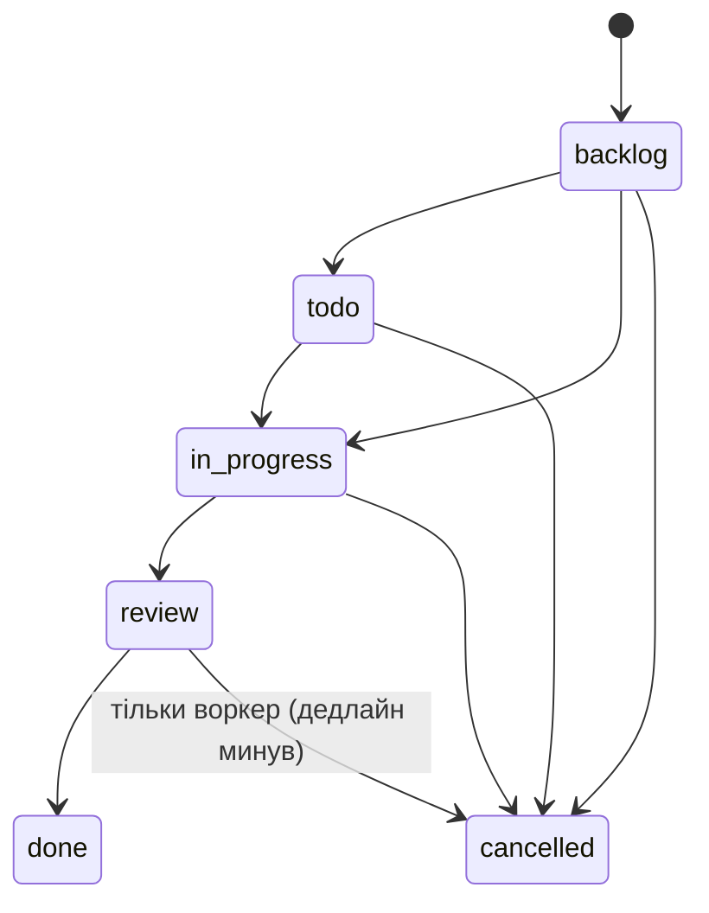

# Task Management API

[](https://github.com/Cervin-van/task_menegement_api/actions/workflows/ci.yml)

REST API для управління задачами: реєстрація/JWT, CRUD задач, виконавці, коментарі, стан-машина статусів,
пошук/фільтри/сортування/пагінація, прострочені задачі, статистика і фоновий воркер автоскасування.

**Стек:** FastAPI · SQLAlchemy 2.0 (async, asyncpg) · PostgreSQL 16 · Alembic · Pydantic v2 · Docker Compose ·
Pytest · BackgroundTasks · uv · ruff.

---

## Швидкий старт

```bash
cp .env.example .env
docker compose up --build
```

- Swagger: http://localhost:8000/docs → **Authorize** (username = email, password) після реєстрації.
- Health: http://localhost:8000/health

Порядок старту: `db` (healthcheck) → `migrate` (`alembic upgrade head`, one-shot) → `api` + `worker`.

### Тести

```bash
docker compose --profile test run --rm --build tests      # 147 тестів проти окремого Postgres (tmpfs)
```

Локально (Python 3.12+, [uv](https://docs.astral.sh/uv/)):

```bash
docker compose --profile test up -d db_test               # 127.0.0.1:5441
uv sync
uv run pytest -q
uv run ruff check . && uv run ruff format --check .
```

CI (GitHub Actions, `.github/workflows/ci.yml`): `ruff` → `pytest` проти Postgres service → `docker build`.

---

## Сервіси Docker Compose

| Сервіс | Що робить | Масштабування |
|---|---|---|
| `db` | PostgreSQL 16, volume `pgdata`, порт `127.0.0.1:5440` | — |
| `migrate` | `alembic upgrade head` один раз на деплой | один екземпляр |
| `api` | Uvicorn, stateless | `UVICORN_WORKERS`, репліки за балансувальником |
| `worker` | автоскасування прострочених задач | safe при N екземплярах (advisory lock) |
| `db_test`, `tests` | профіль `test` | — |

Один образ (multi-stage, uv, non-root) для `migrate`/`api`/`worker` — різні лише команди.
Міграції винесені з entrypoint API, щоб репліки не ганяли їх паралельно; воркер винесений з `lifespan` API,
щоб не множитись разом з репліками. Пул БД — `DB_POOL_SIZE`/`DB_MAX_OVERFLOW` на процес:
сумарно `репліки × воркери × (pool + overflow)` має вкладатися в `max_connections`.

---

## API (`/api/v1`)

| Метод | Шлях | Опис |
|---|---|---|
| POST | `/auth/register` | реєстрація → 201 |
| POST | `/auth/login` | OAuth2 form (`username`=email) → access + refresh |
| POST | `/auth/refresh` | нова пара токенів за refresh-токеном |
| GET | `/users/me` | поточний користувач |
| POST | `/tasks` | створити задачу (завжди `backlog`) |
| GET | `/tasks` | список: пошук, фільтри, сортування, пагінація |
| GET | `/tasks/overdue` | прострочені (дедлайн минув, не done/cancelled) |
| GET | `/tasks/stats` | статистика |
| GET | `/tasks/{id}` | задача |
| PATCH | `/tasks/{id}` | часткове редагування (без статусу) |
| PATCH | `/tasks/{id}/status` | зміна статусу |
| DELETE | `/tasks/{id}` | видалення → 204 |
| POST | `/tasks/{id}/comments` | додати коментар |
| GET | `/tasks/{id}/comments` | коментарі (хронологічно, пагінація) |

### `GET /tasks`

| Параметр | Приклад |
|---|---|
| `search` | пошук по назві та опису без урахування регістру |
| `status` (кілька) | `?status=todo&status=review` |
| `priority` (кілька) | `?priority=high` |
| `assignee_id` | `?assignee_id=3` |
| `deadline_from`, `deadline_to` | ISO 8601 з таймзоною |
| `sort_by` | `created_at` \| `deadline` \| `priority` |
| `order` | `asc` \| `desc` (за замовчуванням: created_at/priority — desc, deadline — asc) |
| `page`, `size` | `size` ≤ 100 |

Без `sort_by`: **priority (High → Medium → Low), потім найближчий дедлайн**, задачі без дедлайну — в кінці.
Відповідь: `{"items": [...], "total": 42, "page": 1, "size": 20, "pages": 3}`. Невідомий параметр → 422.

### Формат помилок

```json
{"error": {"code": "INVALID_STATUS_TRANSITION", "message": "Transition 'review' -> 'todo' is not allowed",
           "details": {"from": "review", "to": "todo", "allowed": ["done"]}}}
```

`401` не автентифіковано · `403` немає прав · `404` не знайдено · `409` порушено бізнес-правило · `422` валідація.

---

## Бізнес-логіка



| Правило | Код помилки |
|---|---|
| Лише переходи зі схеми; повернення назад — помилка | 409 `INVALID_STATUS_TRANSITION` |
| `review` тільки з виконавцем (інакше задача застрягла б: у review виконавець заблокований) | 409 `REVIEW_REQUIRES_ASSIGNEE` |
| `done` тільки з виконавцем | 409 `DONE_REQUIRES_ASSIGNEE` |
| `done` не можна після дедлайну | 409 `DONE_AFTER_DEADLINE` |
| Дедлайн при створенні/редагуванні не в минулому | 422 `DEADLINE_IN_PAST` |
| У `review`/`done` виконавця змінювати не можна | 409 `ASSIGNEE_LOCKED` |
| `done`/`cancelled` не редагуються (ні поля, ні статус) | 409 `TASK_NOT_EDITABLE` |
| `in_progress`/`review` не видаляються | 409 `TASK_NOT_DELETABLE` |
| ≤ 10 активних задач (todo/in_progress/review) на виконавця | 409 `ASSIGNEE_TASK_LIMIT_EXCEEDED` |
| Редагувати/міняти статус — автор або виконавець; видаляти — автор | 403 `PERMISSION_DENIED` |
| Змінювати виконавця — тільки автор | 403 `ASSIGNEE_CHANGE_FORBIDDEN` |
| id поза межами `INTEGER` (1..2³¹−1), невідомі поля в тілі, `order` без `sort_by` | 422 `VALIDATION_ERROR` |

### Рішення по неоднозначностях ТЗ

- **Статус `Todo`.** У переліку статусів його немає, але він фігурує в правилах переходів і ліміті активних задач →
  додано як необов'язковий крок планування: `backlog → todo → in_progress`. Прямий `backlog → in_progress`
  (приклад із ТЗ) теж дозволений.
- **Ліміт 10 активних** рахується для **виконавця** (це його навантаження). Перевіряється при призначенні на
  активну задачу і при переході з `backlog` в `todo`/`in_progress`.
- **Права** в ТЗ не описані: редагувати і змінювати статус — автор або виконавець; змінювати виконавця і
  видаляти — тільки автор (інакше виконавець міг би передати задачу будь-кому й сам втратити до неї доступ).
  Переглядати задачі, список, статистику і коментувати може будь-який автентифікований користувач.
- **Автоскасування** — системний перехід з будь-якого незавершеного статусу, включно з `review`
  (для користувача `review → cancelled` заборонено). ТЗ прямо вимагає скасовувати все, що не завершено до дедлайну.
- **Дедлайн «не менший за поточну дату»** трактується як поточний момент часу (datetime з таймзоною;
  naive datetime → 422). При редагуванні перевіряється лише якщо дедлайн змінюється — інакше задачу з уже
  простроченим дедлайном неможливо було б відредагувати взагалі.
- **Коментарі** дозволені й до `done`/`cancelled`: коментар — обговорення, а не редагування задачі.
- **Статус змінюється тільки** через `PATCH /tasks/{id}/status`; поле `status` у `PATCH /tasks/{id}` → 422.
- Нова задача завжди створюється в `backlog`.
- **`/tasks/overdue` і `stats.overdue` зазвичай близькі до нуля**: воркер скасовує прострочені задачі щохвилини.
  Це наслідок самого ТЗ (дві вимоги працюють над тими самими задачами); endpoint показує те, що воркер ще не
  встиг обробити (або коли він вимкнений).

---

## Архітектура

```
api/v1 (routers, тонкі) → services (бізнес-правила) → repositories (запити) → models
                              │
                              └─ domain events ──► BackgroundTasks ──► notifications (лог)
workers/overdue.py ── advisory lock ── SELECT ... SKIP LOCKED + bulk UPDATE ── domain events ──► notifications
```

Ключові рішення:

- **Стан-машина як дані** — `ALLOWED_TRANSITIONS` у `app/domain/status.py`; тест перевіряє всі 36 пар переходів.
- **Гонки.**
  - Редагування і зміна статусу беруть задачу через `SELECT ... FOR NO KEY UPDATE`.
  - Ліміт 10 задач: спершу такий самий лок на рядок виконавця, потім `count`. Два паралельні призначення не проскочать ліміт — це перевіряє тест із реальними паралельними транзакціями.
  - Саме `NO KEY`, а не `FOR UPDATE`: FK-перевірки при INSERT беруть `KEY SHARE` на батьківський рядок. З `FOR UPDATE` редагування задачі блокувало б додавання коментарів до неї, а призначення на користувача — створення ним нових задач.
  - Воркер і користувач: воркер лочить кандидатів `FOR NO KEY UPDATE SKIP LOCKED`. Задачу, яку користувач
    саме редагує (наприклад, закриває), воркер не чекає, а пропускає до наступного проходу.
  - Deadlock неможливий: усюди порядок «задача → користувач», воркер лочить лише задачі.
- **Воркер** (`app/workers/overdue.py`).
  - `pg_try_advisory_xact_lock`: неблокуючий, знімається сам на commit/rollback, тож падіння процесу не залишить завислого лока.
  - Один `SELECT` (разом з email для нотифікацій) і один масовий `UPDATE` замість збереження кожного рядка.
  - Після commit надсилає ті самі події `TaskStatusChanged`, що й ручна зміна статусу — автору і виконавцю.
  - Graceful shutdown по SIGTERM.
- **Нотифікації.** Сервіс після успішного `commit` складає доменні події (`TaskAssigned`, `TaskStatusChanged`).
  Роутер віддає їх у FastAPI `BackgroundTasks`. Доставка зараз — структурований лог. Щоб перейти на email чи
  чергу, треба змінити лише `app/notifications.py`. Той, хто зробив зміну, повідомлення не отримує.
- **«Прострочена задача»** визначається в одному місці, `overdue_condition(now)`. Цю умову використовують endpoint,
  статистика і воркер.
- **Статистика одним запитом.**
  - `count(*) FILTER (WHERE ...)` на кожну метрику, статус і пріоритет — один прохід по таблиці.
  - Значення, яких немає в базі, повертаються нулями.
- **Індекси.**
  - `(priority DESC, deadline ASC NULLS LAST)` — під сортування за замовчуванням.
  - Пріоритет зберігається як `smallint` (1/2/3) через `TypeDecorator`, тож сортування не потребує `CASE`.
  - GIN `pg_trgm` на `title`/`description` — під `ILIKE '%q%'`. Спецсимволи `%`, `_`, `\` у пошуковому запиті екрануються.
  - `(task_id, created_at)` — для коментарів.
  - `created_at` — під `sort_by=created_at`.
  - Partial `(deadline) WHERE status NOT IN ('cancelled','done')` — для overdue, статистики і воркера: завершена
    історія не роздуває скан. Умова в запитах записана літералами (а не bind-параметрами), тож Postgres бере
    цей індекс і в generic-плані prepared statement (asyncpg).
  - `NULLS LAST` лише для `deadline`: на NOT NULL-колонках він не збігся б з порядком індексу і вимкнув би його.
  - `CHECK (priority BETWEEN 1 AND 3)` — щоб зіпсоване значення не ламало читання.
  - Окремі індекси на `status`, `assignee_id`, `deadline`, `author_id`.
- **Стабільна пагінація** — останнім ключем сортування завжди йде `id`.
- **Auth.**
  - Пара токенів access і refresh. Поле `type` у токені не дає використати refresh-токен як access і навпаки.
  - Паролі хешуються argon2 (`pwdlib`; passlib більше не підтримується) у thread pool — CPU-важке хешування
    не блокує event loop і решту запитів.
  - Для невідомого email пароль перевіряється проти фіктивного хешу, тож за часом відповіді не видно, які email зареєстровані.
- **Async-безпека.** Усі зв'язки моделей — `lazy="raise"`, тож кожне завантаження явне (`selectinload`).
  `eager_defaults` повертає `created_at`/`updated_at` одразу при записі через `RETURNING`.
- **Тести.**
  - Справжній Postgres, схема будується міграціями (`downgrade base → upgrade head`).
  - Кожен тест іде в транзакції з відкатом; `commit` у сервісах стає savepoint.
  - Час підміняється через `time-machine`.
  - 147 тестів, серед них повна матриця переходів статусів (очікування прописані в тесті явно, а не взяті з
    коду), гонка за advisory lock, SKIP LOCKED воркера, graceful stop і реальна паралельна гонка за ліміт.
    Перевірено: без локів ці тести падають.
  - Тести відмовляються стартувати, якщо назва БД не закінчується на `_test` (вони роблять `downgrade base`).
- **Помилки.**
  - Доменні винятки, валідація, HTTP-помилки і необроблені винятки віддаються в одному форматі; для 500 деталі йдуть тільки в лог.
  - `JWT_SECRET_KEY` обов'язковий і не коротший за 32 символи — з небезпечним секретом застосунок не стартує.

### Структура

```
app/
  api/            deps.py, errors.py, health.py, v1/{auth,users,tasks,comments,router}.py
  core/           config.py, security.py, exceptions.py, logging.py
  db/             base.py (naming convention), session.py, types.py (PriorityType)
  domain/         status.py (enums, стан-машина, константи), events.py
  models/         user.py, task.py, comment.py
  repositories/   user.py, task.py, comment.py
  schemas/        auth.py, user.py, task.py, comment.py, common.py (Page[T])
  services/       auth.py, task.py, comment.py
  workers/        overdue.py
  notifications.py
alembic/          async env, міграції
tests/            conftest.py + тести по фічах
```

### Свідомо поза scope / наступні кроки для production

- **Auth:** відкликання і ротація refresh-токенів (blacklist по `jti`), rate limiting на `/auth/login`, ролі.
- **Нотифікації:** зараз `BackgroundTasks` у процесі API — при падінні процесу після commit подія губиться.
  Для гарантованої доставки: transactional outbox + черга (Redis/RabbitMQ) з retry.
- **БД під навантаженням:** keyset-пагінація замість `OFFSET` + `COUNT(*)`; кеш або агрегатна таблиця для
  stats; PgBouncer (transaction mode, `statement_cache_size=0` для asyncpg); read-репліки для списків.
- **Воркер на великих обсягах:** батчі (`LIMIT 1000` у циклі), щоб не тримати локи на тисячах рядків.
- **Пул з'єднань:** `репліки × UVICORN_WORKERS × (DB_POOL_SIZE + DB_MAX_OVERFLOW)` має бути менше за
  `max_connections` (100 за замовчуванням); з `.env.example` це 40 на репліку. Воркеру достатньо `DB_POOL_SIZE=1`.
- **Операційне:** `/health/live` і `/health/ready` окремо, healthcheck воркера, JSON-логи з request-id,
  метрики, трейсинг; секрети через vault замість `.env`.
- **Масштабування API в compose:** `--scale api=N` потребує балансувальника (порт `8000` зараз фіксований).
